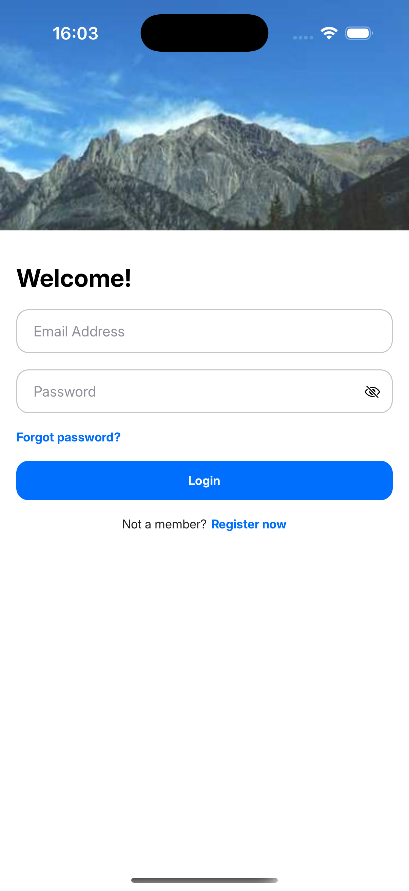
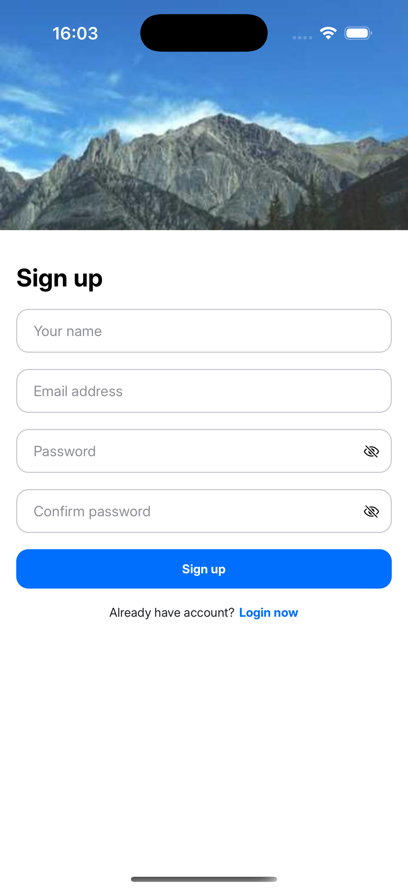

# CookEasy

CookEasy is a beautiful mobile app for discovering, creating, and managing recipes. It features user authentication, recipe creation, favorites, and intuitive navigation—all built with React Native and Redux.

## Features

- **User Authentication**: Register, login, and restore password.
- **Recipe Management**: Add, view, and edit recipes with ingredients and steps.
- **Favorites**: Mark recipes as favorites for quick access.
- **Search & Filtering**: Find recipes by name or category.
- **Responsive UI**: Clean, modern design with reusable components.

## Screenshots

### Login & Register



### Recipe Management


### Favorites & Filtering


### Restore Password


## Technologies Used

- React Native
- Redux Toolkit
- TypeScript
- MockAPI (for backend)
- React Navigation

## Getting Started

1. **Clone the repository**
   ```sh
   git clone <repo-url>
   cd CookEasy
   ```
2. **Install dependencies**
   ```sh
   npm install
   ```
3. **Run the app**
   ```sh
   npm start
   # or for iOS
   npx react-native run-ios
   # or for Android
   npx react-native run-android
   ```

## Folder Structure

- `src/pages/` — Main screens (Add, Details, Favorites, Home, Auth)
- `src/components/` — Reusable UI components
- `src/store/` — Redux slices and store setup
- `src/assets/` — Fonts and images
- `screenshots/` — App screenshots for documentation

## Contributing

Pull requests are welcome! For major changes, please open an issue first to discuss what you would like to change.

## License

This project is licensed under the MIT License.

